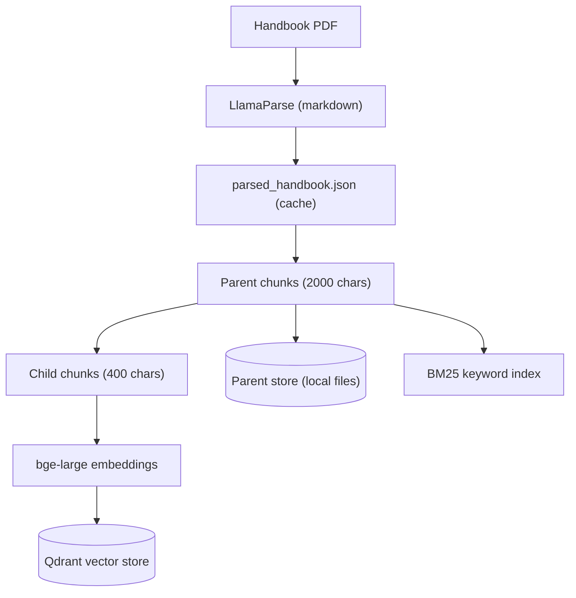
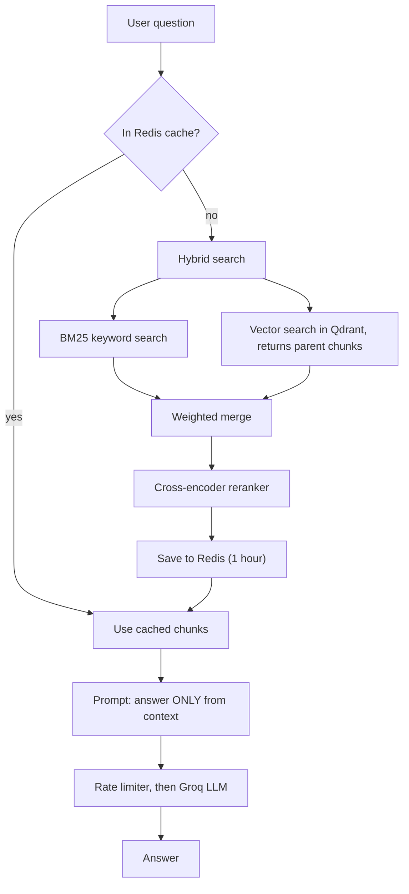

# Enterprise Handbook RAG

A question-answering system that lets employees ask plain-English questions about a company handbook and get answers grounded **only** in the handbook text. It combines parent-child chunking, hybrid search (BM25 + vectors), cross-encoder reranking, and a Redis cache, and it ships with an evaluation set so retrieval quality is **measured, not guessed**.

> **Example:** *"If you suspect an offender doesn't realize they are guilty of harassment, what should you do?"*
> The system finds the relevant harassment-policy section and answers from it. If the answer is not in the handbook, it says so instead of making something up.

---

## Highlights

- **Layout-aware parsing** with LlamaParse, so headings, bullets, and tables survive as markdown.
- **Parent-child retrieval:** small chunks (400 chars) are searched for precision, and the larger parent chunk (2000 chars) is returned for context.
- **Hybrid search:** BM25 keyword search + vector search in Qdrant, merged with weighted rank fusion.
- **Cross-encoder reranking** (`bge-reranker-large`) to pick the best chunks from the candidates.
- **Redis caching** of retrieved chunks, with graceful fallback if Redis is not running.
- **Rate-limited LLM calls** to stay within Groq limits.
- **Hallucination guard:** the prompt restricts answers to the retrieved context and gives a fixed "I couldn't find this in the handbook" fallback; temperature is 0.
- **Evaluation suite:** 36 questions with ground-truth evidence from the handbook, plus 4 out-of-scope questions.

---

## Architecture

### 1. Indexing (runs once, results are cached)



### 2. Answering a question



---

## Tech stack

| Area | Tools |
|---|---|
| Language | Python 3.11 |
| Orchestration | LangChain |
| PDF parsing | LlamaParse |
| Embeddings | `BAAI/bge-large-en-v1.5` (1024 dimensions, cosine similarity) |
| Vector database | Qdrant (local mode) |
| Keyword search | BM25 (`rank-bm25`) |
| Reranker | `BAAI/bge-reranker-large` cross-encoder |
| LLM | Groq (`openai/gpt-oss-20b`) |
| Cache | Redis (optional) |

---

## Project structure

```
.
├── rag_corrected.py       # the RAG pipeline (parsing, indexing, retrieval, answering)
├── evaluate.py            # runs the evaluation and prints a score
├── eval_questions.json    # test questions + ground-truth evidence
├── .env.example           # template for your keys and settings
├── requirements.txt
└── data/                  # put your handbook PDF here (not committed)
```

**Why separate files?** The pipeline is the product, the questions are data, and the evaluation is a tool that uses the pipeline. Keeping them apart means the pipeline can later be imported by an API without running tests, and questions can be edited without touching code.

---

## Getting started

### 1. Install

```bash
git clone https://github.com/venkateshrao-1706/enterprise-handbook-rag.git
cd enterprise-handbook-rag
pip install redis python-dotenv langchain-groq langchain-huggingface langchain-qdrant \
    langchain-classic langchain-community langchain-text-splitters qdrant-client \
    llama-cloud-services rank-bm25 sentence-transformers
```

### 2. Add your keys

Copy `.env.example` to `.env` and fill it in:

```
GROQ_API_KEY=your_groq_key
LLAMA_CLOUD_API_KEY=your_llamacloud_key
PDF_PATH=data/Employee-Handbook.pdf
FORCE_RESET=false
LLM_CALLS_PER_MINUTE=20
```

### 3. Add the handbook

Place your PDF at the path set in `PDF_PATH`.

### 4. (Optional) Start Redis

The app works without it. If Redis runs on `127.0.0.1:6379`, repeated questions are served from cache.

### 5. Ask a question

```bash
python rag_corrected.py
```

The first run parses the PDF, builds the indexes, and downloads the models, so it takes a few minutes. Later runs reuse the saved data.

To use it from your own code:

```python
from rag_corrected import answer_question

print(answer_question("How many days of paid time off do employees get?"))
```

### Rebuilding from scratch

Set `FORCE_RESET=true` in `.env` for **one** run after changing the PDF, chunk sizes, or embedding model. This deletes the saved vector store, parent store, and parsed cache. Set it back to `false` afterwards.

---

## Evaluation

Retrieval is the foundation of a RAG system: if the right text never reaches the LLM, no prompt can fix the answer. So the evaluation measures retrieval first.

### How it works

- `eval_questions.json` holds **36 answerable questions** across every handbook section (hiring, harassment, safety, benefits, PTO, discipline, and more) and **4 out-of-scope questions** (stock options, marriage leave, pets, 401k).
- Each answerable question has an **evidence phrase** copied from the handbook.
- `evaluate.py` sends each question to the retriever and checks whether the evidence phrase appears in the returned chunks. If it does, retrieval **hit**. If not, it prints `Missed: ...`.

```bash
python evaluate.py
```

```
Missed: <question that failed>
Score: XX/36 = XX%
```

### Results

> Replace the `XX` values with your own scores. Run the evaluation once per configuration and change **one thing at a time**.

| Configuration | BM25 k | Weights (BM25 / vector) | Chunks returned | Score |
|---|---|---|---|---|
| Baseline | 2 | 0.6 / 0.4 | 3 | XX / 36 (XX%) |
| Tuned | 5 | 0.3 / 0.7 | 5 | XX / 36 (XX%) |

Optional comparison of retrieval methods (change `rag.compressor_retriever` in `evaluate.py` to the name shown):

| Retriever | Variable in code | Score |
|---|---|---|
| Vector only | `rag.retriever` | XX / 36 |
| Hybrid (no reranker) | `rag.Hybrid` | XX / 36 |
| Hybrid + reranker | `rag.compressor_retriever` | XX / 36 |

> **Fair-comparison note:** a configuration that returns more chunks has more chances to contain the evidence, so compare configurations with the same number of returned chunks when you can.

### Limitations of this evaluation

- It uses exact-text matching, so a "miss" can sometimes come from the parser changing a symbol, not from bad retrieval. Inspect misses before drawing conclusions.
- It tests **retrieval only**, not the wording or faithfulness of the final LLM answer.
- The 4 out-of-scope questions are included in the question file to test refusals but are skipped by the current script.

---

## Design decisions and trade-offs

| Decision | Why | Trade-off |
|---|---|---|
| LlamaParse over a basic PDF loader | Preserves headings, lists, and tables | Costs API credits, so the result is cached to JSON |
| Parent-child chunks | Precise matching plus enough context for the LLM | More storage and a second lookup |
| Hybrid BM25 + vectors | Keywords catch exact terms (e.g. "FLSA"), vectors catch paraphrases (e.g. "time off" vs "leave") | Weights need tuning, which is what the evaluation is for |
| Cross-encoder reranker | More accurate than embeddings alone | Slow on CPU, so it only scores a small candidate set |
| Redis cache, optional | Skips slow retrieval for repeated questions | Entries can go stale if the handbook or settings change |
| Rate limiter on the LLM call | That call is the one limited by Groq | In-memory and per process, not per user |
| `temperature=0` | Stable, factual answers | Less varied phrasing |

---

## Known limitations

- Qdrant runs in **local mode**, which allows one process at a time. A multi-worker deployment needs a Qdrant server.
- The handbook used for testing is a **template** with `[placeholders]`, so some answers contain bracketed values.
- There are no source citations in answers yet.
- Prompt-injection protection is basic (instruction in the prompt only).

## Roadmap

- [ ] Source citations (section or page) with every answer
- [ ] FastAPI endpoint (`POST /ask`, `GET /health`)
- [ ] Docker Compose setup (app + Redis + Qdrant server)
- [ ] Answer-quality evaluation (faithfulness and refusal on out-of-scope questions)
- [ ] Header-aware chunking using the markdown structure
- [ ] Agent tools (leave balance lookup, HR ticket creation)
- [ ] Cloud deployment

---

## Author

**Venkatesh Rao** · AI/ML Engineer (aspiring) · Hyderabad, India

[GitHub](https://github.com/venkateshrao-1706) · [LinkedIn](https://linkedin.com/in/venkateshrao014)
